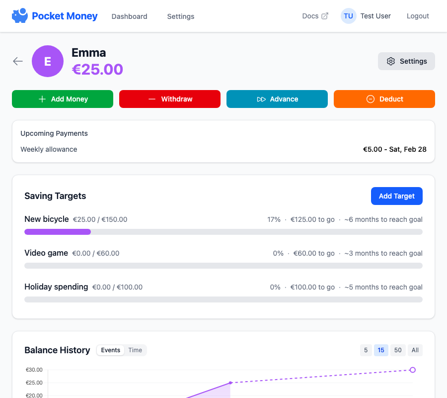

# Pocket Money

A family pocket money tracking PWA built with SvelteKit, hosted on Cloudflare Pages with D1 database.



## Features

- **Family System**: Invite family members to share access to children's accounts
- Track pocket money for multiple children
- Set saving targets with visual progress tracking
- Recurring automatic payments (allowance)
- Transaction history with parent attribution
- Optional PIN protection (per-family)
- Photo uploads for profiles (stored as base64)
- Multi-currency support
- Mobile-friendly PWA

## Tech Stack

- **Framework**: SvelteKit with Cloudflare adapter
- **Database**: Cloudflare D1 (SQLite)
- **Hosting**: Cloudflare Pages
- **Styling**: Tailwind CSS
- **Charts**: Chart.js

## Quick Start

See [docs/installation.md](docs/installation.md) for detailed setup instructions.

```bash
# Clone and install
git clone https://github.com/ewels/pocket-money.git
cd pocket-money
npm install

# Configure
cp .dev.vars.example .dev.vars
# Edit .dev.vars with your SESSION_SECRET

# Run locally
npm run dev
```

## Documentation

- [Installation & Deployment](docs/installation.md) - Setup for local development and production
- [User Guide](docs/usage.md) - How to use the app
- [Architecture](docs/architecture.md) - Technical overview

## Cloudflare Free Tier Limits

These limits are more than sufficient for family use:

- **Pages**: Unlimited requests, 500 builds/month
- **D1**: 5M reads/day, 100K writes/day

## License

MIT
