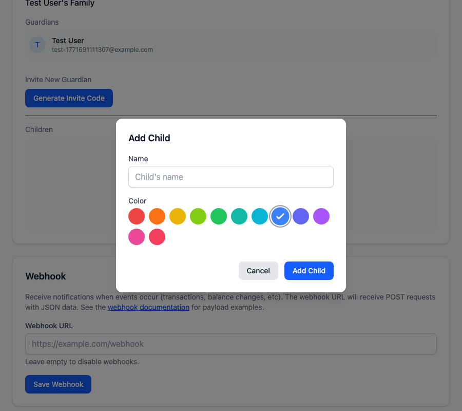
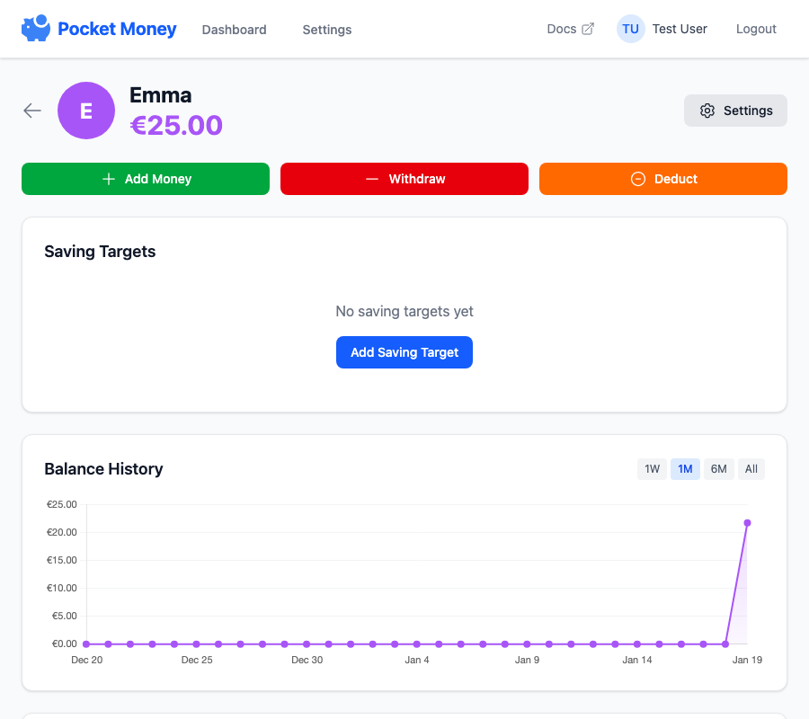
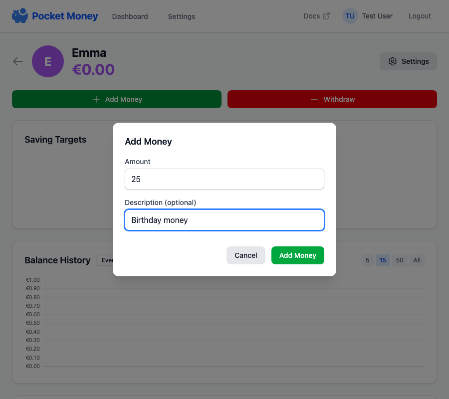

# Managing Children

## Adding a Child

1. From the dashboard, click **Add Child**
2. Enter the child's name
3. Choose a color for their profile
4. Click **Add**

## Child Profile

Click on a child's card to view their profile:

- **Balance** - Current total balance
- **Balance History** - 30-day chart showing balance changes
- **Saving Targets** - Progress toward savings goals
- **Recent Transactions** - List of deposits and withdrawals
- **Recurring Payments** - Active automatic payments

## Adding Money

1. Open a child's profile
2. Click **Add Money**
3. Enter the amount
4. Optionally add a description (e.g., "Birthday money from Grandma")
5. Click confirm

## Withdrawing Money

1. Open a child's profile
2. Click **Withdraw**
3. Enter the amount (cannot exceed current balance)
4. Optionally add a description (e.g., "Bought a toy")
5. Click confirm

## Editing a Child

Click the gear icon on a child's profile to access settings:

- **Name** - Change the child's display name
- **Color** - Change their profile color
- **Photo** - Upload a profile picture

## Deleting a Child

!!! warning "This cannot be undone"
Deleting a child removes all their transactions, saving targets, and recurring rules.

1. Go to child settings (gear icon)
2. Scroll to the bottom
3. Click **Delete Child**
4. Confirm the deletion

## Transaction History

Each transaction shows:

- **Amount** - Positive (green) for deposits, negative (red) for withdrawals
- **Description** - Optional note about the transaction
- **Who** - Which family member made the transaction
- **When** - Date and time
- **Type** - Manual or recurring (automatic allowance)
