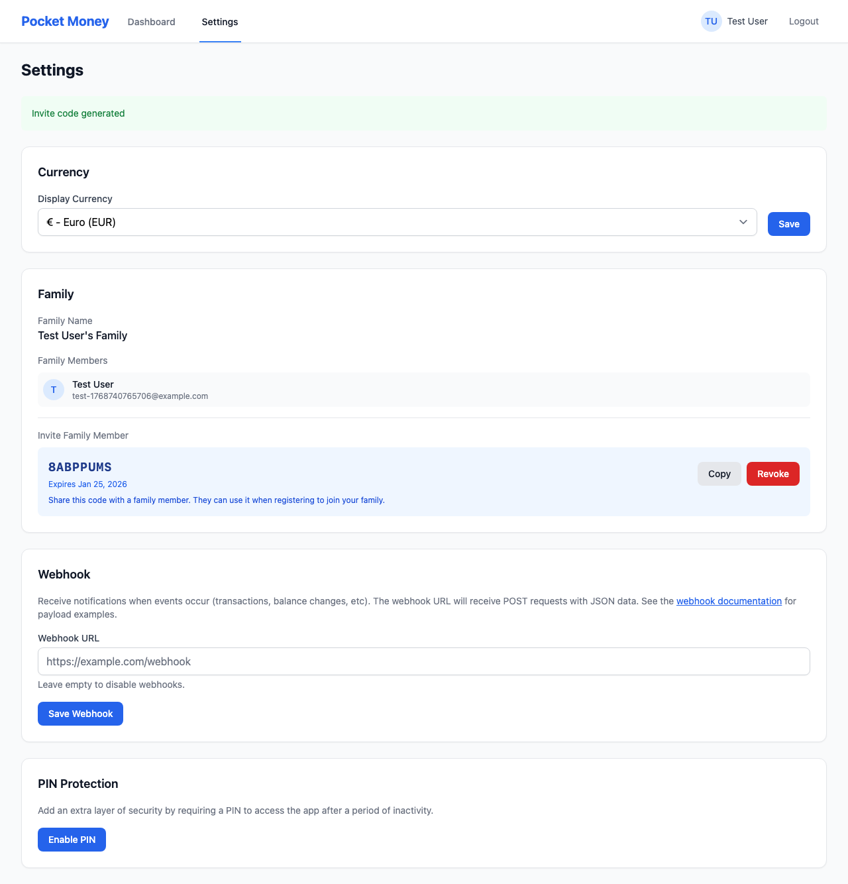

# Family & Invites

The family system allows multiple parents or guardians to share access to children's accounts.

## How Families Work

- Each user belongs to exactly one family
- Children belong to a family, not individual users
- All family members can view and manage all children
- Settings (currency, PIN) are shared per-family

## Creating a Family

When you register **without** an invite code, a new family is automatically created with you as the first member.

The family is named "[Your Name]'s Family" by default.

## Inviting Family Members

To invite someone (spouse, co-parent, grandparent, etc.):

1. Go to **Settings**
2. In the **Family** section, click **Generate Invite Code**
3. Share the 8-character code with the person you're inviting
4. They enter the code when registering a new account

### Invite Code Details

- **Format**: 8 uppercase letters and numbers (e.g., `ABC12XY3`)
- **Expires**: 7 days after generation
- **Single use**: Each code can only be used once
- **Revokable**: You can delete an unused code and generate a new one

## Joining a Family

To join an existing family:

1. Get an invite code from a family member
2. Go to the registration page
3. Fill in your details (name, email, password)
4. Enter the invite code in the **Invite Code** field
5. Click **Create account**

You'll immediately have access to all children in that family.

## Family Members List

In Settings, you can see all members of your family:

- Name
- Email
- Profile photo (if set)

## What's Shared

| Shared Across Family | Per-User          |
| -------------------- | ----------------- |
| Children             | Login credentials |
| Transactions         | Name              |
| Saving targets       | Profile photo     |
| Recurring rules      |                   |
| Currency setting     |                   |
| PIN setting          |                   |

## Security Considerations

- Only share invite codes with people you trust
- All family members have equal access to all children
- Any family member can add/withdraw money
- Any family member can change settings
- Transactions show who made them for accountability
