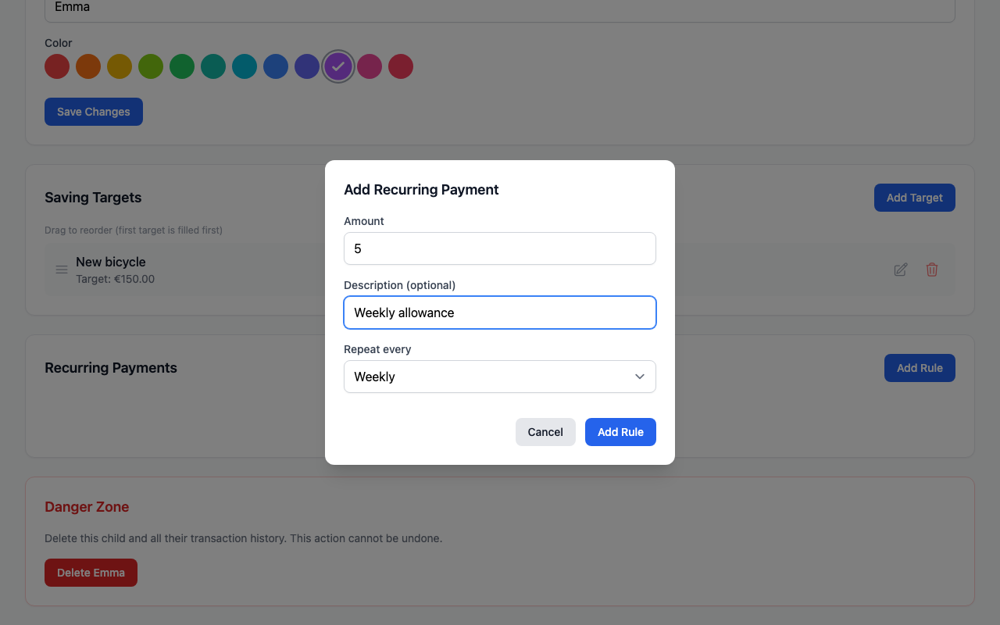

# Recurring Payments

Set up automatic allowance deposits on any schedule.

## Setting Up Allowance

1. Go to a child's settings (gear icon on their profile)
2. In the **Recurring Payments** section, click **Add Rule**
3. Enter the amount
4. Choose the interval:
   - **Daily** - Every day
   - **Weekly** - Every 7 days
   - **Bi-weekly** - Every 14 days
   - **Monthly** - Every 30 days
5. Add an optional description (e.g., "Weekly allowance")
6. Click **Add**

The first payment will be deposited at the next scheduled interval.

## Managing Recurring Payments

Each recurring payment can be:

### Paused / Resumed

Toggle the rule on or off without deleting it. Useful for:

- Vacation periods
- When allowance is temporarily suspended
- Testing the setup

### Skip Next Payment

Skip just the next scheduled payment, then continue as normal. The skip flag resets after one payment cycle.

Use this when:

- A child already received extra money
- You want to skip a holiday week
- One-time adjustment needed

### Deleted

Remove the rule entirely. Use the trash icon to delete.

## When Payments Run

Recurring payments are processed when the `/api/cron` endpoint is called. This should be configured to run daily - see the [Deployment Guide](../getting-started/deployment.md#set-up-recurring-payments).

!!! info "Timing"
    Payments are deposited when the cron job runs, typically once per day. The exact time depends on your cron schedule.

## Transaction Attribution

Recurring payments appear in the transaction history as:

- **Type**: Recurring (indicated by an icon)
- **Who**: System (no user attributed)
- **Description**: Whatever you set when creating the rule

## Examples

### Weekly Allowance

- Amount: $10
- Interval: Weekly (7 days)
- Description: "Weekly allowance"

### Monthly Savings Bonus

- Amount: $5
- Interval: Monthly (30 days)
- Description: "Monthly savings bonus"

### Daily Chore Payment

- Amount: $1
- Interval: Daily
- Description: "Daily chores"
