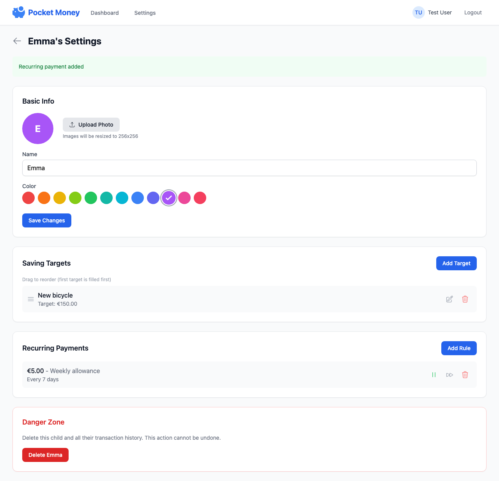

# Saving Targets

Saving targets help children work toward financial goals with visual progress tracking.

## Creating a Target

1. Go to a child's settings (gear icon on their profile)
2. In the **Saving Targets** section, click **Add Target**
3. Enter the target name (e.g., "New Bike", "Video Game")
4. Enter the target amount
5. Optionally add:
   - **Description** - Additional details about the item
   - **Link** - URL to where the item can be purchased
   - **Photo** - Upload an image of the item
6. Click **Add Target**

## How Progress is Calculated

When you have multiple targets, they "stack" - meaning the first target fills up before the second one starts.

**Example with stacking:**

- Target 1: $50 for a video game
- Target 2: $30 for a book
- Current balance: $60

Progress:

- Target 1: 100% (fully funded with $50)
- Target 2: 33% (remaining $10 of $30)

This prioritization helps children focus on saving for one thing at a time.

## Reordering Targets

You can change which target gets filled first by reordering them:

1. Go to child settings
2. In the Saving Targets section, drag targets using the handle on the left
3. Drop to reorder
4. The topmost target is filled first

!!! tip
    On mobile devices, you can also use touch to drag and reorder targets.

## Editing a Target

1. Go to child settings
2. Find the target in the list
3. Click the edit icon (pencil)
4. Update any fields (name, amount, description, link, or photo)
5. Click **Save**

## Deleting a Target

1. Go to child settings
2. Find the target in the list
3. Click the delete icon (trash)
4. The target is removed immediately

## Target Photos and Links

Adding a photo helps visualize the goal, and a link makes it easy to find the item when ready to purchase.

- **Photos** are displayed in the target list and on the child's profile
- **Links** open in a new tab when clicked on the child's profile

## Tips for Parents

- **Start small** - Begin with achievable targets to build the saving habit
- **Be specific** - "New Lego Set" is more motivating than "Toys"
- **Add pictures** - Visual goals are more motivating for children
- **Celebrate success** - When a target is reached, acknowledge the achievement
- **Use stacking wisely** - Put the most important goal first
