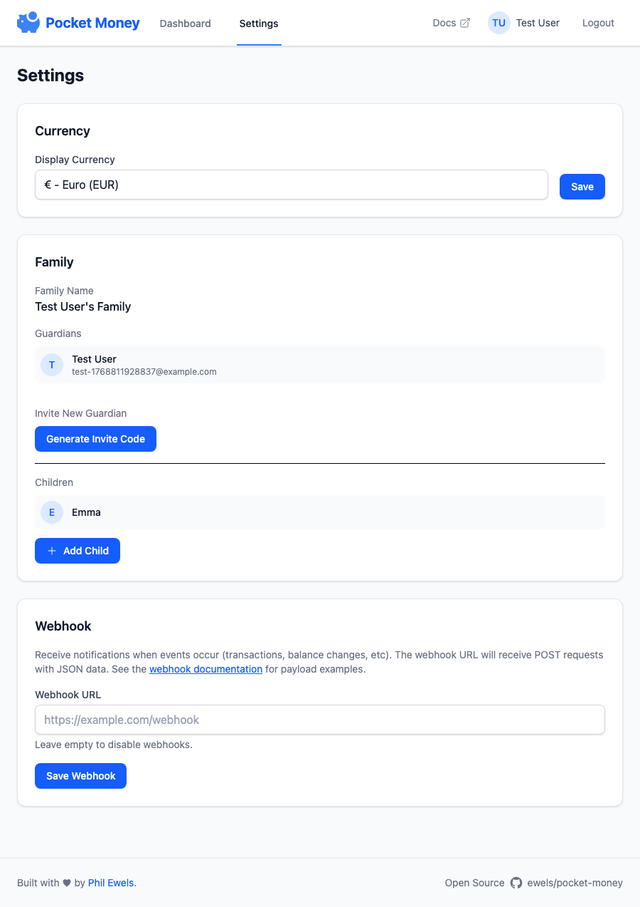

# Settings

Configure app-wide settings for your family.

## Currency

Change the display currency for all amounts in the app.

### Supported Currencies

| Code | Currency          |
| ---- | ----------------- |
| EUR  | Euro              |
| GBP  | British Pound     |
| USD  | US Dollar         |
| SEK  | Swedish Krona     |
| NOK  | Norwegian Krone   |
| DKK  | Danish Krone      |
| CHF  | Swiss Franc       |
| AUD  | Australian Dollar |
| CAD  | Canadian Dollar   |
| JPY  | Japanese Yen      |
| PLN  | Polish Zloty      |
| CZK  | Czech Koruna      |

!!! note

    Currency is a display setting only. It doesn't convert values between currencies.

### Changing Currency

1. Go to **Settings**
2. Select your currency from the dropdown
3. Click **Save**

## PIN Protection

Add extra security by requiring a PIN after periods of inactivity.

### Enabling PIN

1. Go to **Settings**
2. Click **Enable PIN**
3. Enter a 4-6 digit PIN
4. Confirm the PIN
5. Click **Enable PIN**

### PIN Timeout

Choose how long before the PIN is required again:

- 1 minute
- 2 minutes
- 5 minutes
- 10 minutes

After this time of inactivity, the app will require PIN entry before showing any data.

### Changing PIN

1. Go to **Settings**
2. Click **Change PIN**
3. Enter your current PIN
4. Enter the new PIN
5. Confirm the new PIN
6. Click **Change PIN**

### Disabling PIN

1. Go to **Settings**
2. Click **Disable PIN**
3. Enter your current PIN
4. Click **Disable PIN**

!!! warning

    PIN settings are shared across all family members. Changing or disabling the PIN affects everyone.

## Family Management

See [Family & Invites](family.md) for details on:

- Viewing family members
- Generating invite codes
- Revoking invite codes

## Profile Settings

Your personal profile settings are separate from family settings:

1. Click your profile icon in the header
2. Update your name or photo
3. Click **Save**

These changes only affect your account, not other family members.
