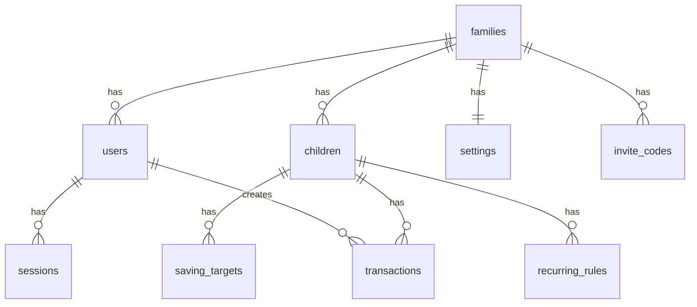

# Database Schema

Pocket Money uses Cloudflare D1, a SQLite-based database.

## Entity Relationships



## Tables

### families

Core family unit that groups users and children.

| Column       | Type    | Description        |
| ------------ | ------- | ------------------ |
| `id`         | TEXT    | Primary key (UUID) |
| `name`       | TEXT    | Family name        |
| `created_at` | INTEGER | Unix timestamp     |

### users

Registered user accounts.

| Column          | Type    | Description                     |
| --------------- | ------- | ------------------------------- |
| `id`            | TEXT    | Primary key (UUID)              |
| `email`         | TEXT    | Unique email address            |
| `password_hash` | TEXT    | bcrypt hash                     |
| `name`          | TEXT    | Display name                    |
| `photo_url`     | TEXT    | External photo URL (nullable)   |
| `photo_data`    | TEXT    | Base64 encoded image (nullable) |
| `family_id`     | TEXT    | Foreign key → families          |
| `created_at`    | INTEGER | Unix timestamp                  |

### invite_codes

Codes for inviting users to join a family.

| Column       | Type    | Description                           |
| ------------ | ------- | ------------------------------------- |
| `id`         | TEXT    | Primary key (UUID)                    |
| `code`       | TEXT    | Unique 8-char alphanumeric code       |
| `family_id`  | TEXT    | Foreign key → families                |
| `created_by` | TEXT    | Foreign key → users                   |
| `expires_at` | INTEGER | Unix timestamp (7 days from creation) |
| `used_by`    | TEXT    | Foreign key → users (nullable)        |
| `used_at`    | INTEGER | Unix timestamp (nullable)             |
| `created_at` | INTEGER | Unix timestamp                        |

### settings

Per-family application settings.

| Column                | Type    | Default | Description                 |
| --------------------- | ------- | ------- | --------------------------- |
| `id`                  | INTEGER | Auto    | Primary key                 |
| `family_id`           | TEXT    |         | Foreign key → families      |
| `currency`            | TEXT    | 'EUR'   | Display currency code       |
| `pin_enabled`         | INTEGER | 0       | PIN protection enabled      |
| `pin_hash`            | TEXT    | NULL    | bcrypt hash of PIN          |
| `pin_timeout_minutes` | INTEGER | 1       | Minutes before PIN required |

### children

Child profiles.

| Column       | Type    | Description                     |
| ------------ | ------- | ------------------------------- |
| `id`         | TEXT    | Primary key (UUID)              |
| `name`       | TEXT    | Display name                    |
| `color`      | TEXT    | Profile color                   |
| `photo_url`  | TEXT    | External photo URL (nullable)   |
| `photo_data` | TEXT    | Base64 encoded image (nullable) |
| `family_id`  | TEXT    | Foreign key → families          |
| `sort_order` | INTEGER | Display order                   |
| `created_at` | INTEGER | Unix timestamp                  |

### saving_targets

Savings goals for children.

| Column          | Type    | Description            |
| --------------- | ------- | ---------------------- |
| `id`            | TEXT    | Primary key (UUID)     |
| `child_id`      | TEXT    | Foreign key → children |
| `name`          | TEXT    | Target name            |
| `target_amount` | REAL    | Goal amount            |
| `sort_order`    | INTEGER | Display order          |
| `created_at`    | INTEGER | Unix timestamp         |

### recurring_rules

Automatic payment rules.

| Column          | Type    | Description                    |
| --------------- | ------- | ------------------------------ |
| `id`            | TEXT    | Primary key (UUID)             |
| `child_id`      | TEXT    | Foreign key → children         |
| `amount`        | REAL    | Payment amount                 |
| `description`   | TEXT    | Optional description           |
| `interval_days` | INTEGER | Days between payments          |
| `next_run_at`   | INTEGER | Unix timestamp of next payment |
| `skip_next`     | INTEGER | Skip next payment flag (0/1)   |
| `active`        | INTEGER | Rule is active (0/1)           |
| `created_at`    | INTEGER | Unix timestamp                 |

### transactions

All money movements.

| Column              | Type    | Description                                  |
| ------------------- | ------- | -------------------------------------------- |
| `id`                | TEXT    | Primary key (UUID)                           |
| `child_id`          | TEXT    | Foreign key → children                       |
| `user_id`           | TEXT    | Foreign key → users (nullable for recurring) |
| `amount`            | REAL    | Positive=deposit, negative=withdrawal        |
| `description`       | TEXT    | Optional description                         |
| `is_recurring`      | INTEGER | Created by recurring rule (0/1)              |
| `recurring_rule_id` | TEXT    | Foreign key → recurring_rules (nullable)     |
| `created_at`        | INTEGER | Unix timestamp                               |

### sessions

User authentication sessions.

| Column            | Type    | Description               |
| ----------------- | ------- | ------------------------- |
| `id`              | TEXT    | Primary key (UUID)        |
| `user_id`         | TEXT    | Foreign key → users       |
| `pin_verified_at` | INTEGER | Unix timestamp (nullable) |
| `expires_at`      | INTEGER | Unix timestamp            |
| `created_at`      | INTEGER | Unix timestamp            |

## Migrations

Migrations are stored in `migrations/` and run in order:

| File                  | Description           |
| --------------------- | --------------------- |
| `0001_initial.sql`    | Core tables           |
| `0002_photo_data.sql` | Photo storage columns |
| `0003_families.sql`   | Family system tables  |

### Running Migrations

Local:

```bash
npm run db:migrate
```

Production:

```bash
wrangler d1 execute pocket-money-db --remote --file=./migrations/0001_initial.sql
wrangler d1 execute pocket-money-db --remote --file=./migrations/0002_photo_data.sql
wrangler d1 execute pocket-money-db --remote --file=./migrations/0003_families.sql
```
